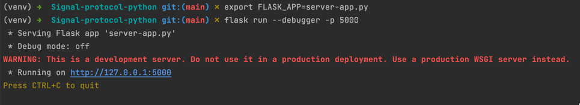
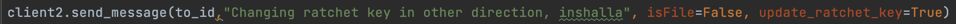
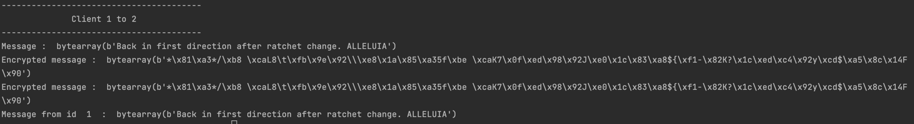
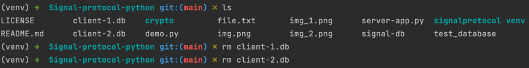

# Signal-protocol-python

This is a project done in the context of a graduate course in cryptography

The aim of this project was to implement the Signal protocol in python from scratch

To launch the demo, start the flask server:

Then launch demo.py.

The file demo.py showcases the features of the project.

The project implements the X3DH handshake, and the double ratchet system, but not  out of order messages.
The messages are encrypted using a stream cipher, the stream is genereted by AES counter mode.
The files are encrypted using AES CBC mode.

Messages can be sent in any direction, we can either specify a file or a text message, and we can optionnaly generate a new ratchet key:

The demo.py file shows that the messages work even after a ratchet change:

The decrypted messages are stored in local databases that should be deleted to start the handshakes from the beginning:
